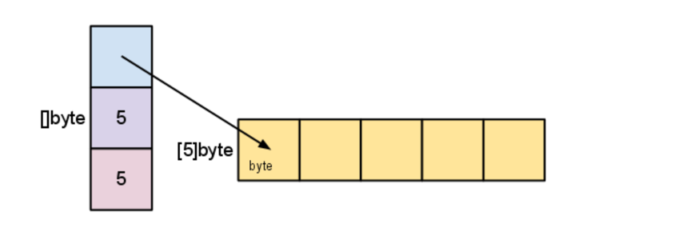
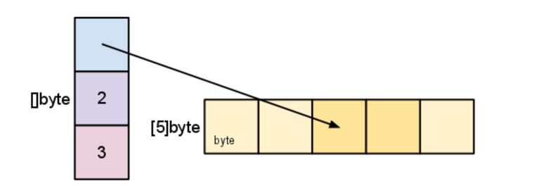

## 데이터 모델
* 대표적으로 Array, Slice, Map 을 제공합니다.

## Array
* 배열을 만든 뒤에는 크기를 수정할 수 없습니다.
* 정의할때 항상 크기를 표시해야 합니다.
```go
firstArray := [4]string{"One", "Two", "Three", "Four"}
```
* 또는, [...]으로 컴파일러에게 이 정의가 배열임을 알려 주어야 합니다.
```go
secondArray := [...]string{"One", "Two", "Three", "Four"}
```
* Array를 함수로 넘길때 배열의 새로운 복사본을 만들어 함수에 전달합니다. 함수에서 배열을 변화시킨 내용은 원래 함수에 반영되지 않습니다.
* 결론적으로 강력하지 않은 Go의 배열을 잘 쓰이지 않습니다. Slice로...

## Slice
* 배열과 유사하지만 생성 후에 필요하다면 크기가 커지거나 작아질 수 있습니다.
* 슬라이스는 배열을 기반으로 구축된 추상화 입니다.
    * 슬라이스 값은 데이터의 길이, 용량, 내부 배열의 포인터를 갖고 있습니다.

```go
type SliceHeader struct {
	Data uintptr
	Len  int
	Cap  int
}
```


* Slice를 함수로 넘길때 헤더만 복사하기 때문에 슬라이스 데이터를 복사해 전달하는 것 보다 성능이 좋습니다.

### 슬라이스의 선언
* 슬라이스는 요소 개수를 생략한다는 점을 제외하면 배열과 동일하게 선언됩니다.
```go
aSlice := []string{"One", "Two", "Three", "Four"}
```

* 또는, make 내장함수를 이용해서 선언할 수 있습니다.
```go
func make([]T, len, cap) []T
```
* make 로 슬라이스 선언하기
```go
var s []byte
s = make([]byte, 5, 5)
```
* 용량 인수를 생략하면 길이와 동일한 용량이 생성됩니다.
```go
s := make([]byte, 5)
```
* cap, len 내장함수를 사용하여 용량과 길이를 확인할 수 있습니다.
```go
len(s) == 5
cap(s) == 5
```

* 슬라이스는 기존 슬라이스를 잘라낸 새 슬라이스를 만들 수 있습니다.
* 콜론(:) 으로 시작 인덱스와 종료 인덱스를 지정하여 잘라낼 수 있습니다. (half-open range)
> half-open range : 시작 인덱스는 포함하고 종료 인덱스는 포함하지 않는 범위
```go
b := []byte{'g', 'o', 'l', 'a', 'n', 'g'}
// b[1:4] == []byte{'o', 'l', 'a'}
```
* 잘라내기를 할때, 시작 인덱스나 종료 인덱스를 생략하여 0 또는 슬라이스의 길이를 의미할 수도 있습니다.
```go
// b[:2] == []byte{'g', 'o'}
// b[2:] == []byte{'l', 'a', 'n', 'g'}
// b[:] == b
```
* 슬라이스를 잘라내면 데이터 배열을 새로 생성하는 것이 아니라 시작 인덱스만 바꾸게 됩니다.
  
* b[2:4]
  
* 따라서 잘라낸 슬라이스 데이터의 값을 바꾸면 기존 슬라이스의 데이터도 변경됩니다.
```go
d := []byte{'g', 'o', 'l', 'a', 'n', 'g'}
e := d[3:]
// e == []byte{'n', 'g'}
e[1] = 'd'
// e == []byte{'n', 'd'}
// d == []byte{'g', 'o', 'l', 'a', 'n', 'd'}
```
### 슬라이스 크기 변경
* 슬라이스의 용량을 늘이는 것은 "큰 새 슬라이스를 생성"하고", "데이터를 복사"하는 순서로 이루어 집니다.
    * 대부분의 언어에서 동적 배열 구현에서 사용하는 방식입니다.
```go
t := make([]byte, len(s), (cap(s)+1)*2) // +1 in case cap(s) == 0
for i := range s {
        t[i] = s[i]
}
s = t
```
* 보통 슬라이스 맨 끝에 데이터를 추가하는 작업을 많이 하기때문에 append 라는 내장함수가 제공됩니다.
```go
func append(s []T, x ...T) []T
```
* 슬라이스 마지막에 원소를 추가하기(List.add)
```go
a := make([]int, 1)
// a == []int{0}
a = append(a, 1, 2, 3)
// a == []int{0, 1, 2, 3}
```
* 슬라이스 마지막에 다른 슬라이스 원소 전체를 추가하기(List.addAll)
```go
a := []string{"John", "Paul"}
b := []string{"George", "Ringo", "Pete"}
a = append(a, b...) // equivalent to "append(a, b[0], b[1], b[2])"
// a == []string{"John", "Paul", "George", "Ringo", "Pete"}
```
> Java 의 ArrayList를 사용하는 곳에서 사용하면 됩니다.

> 출처 : https://go.dev/blog/slices-intro

## Map
* go는 HashTable을 구현한 내장 map 을 제공합니다.
* ConcurrentHashMap 처럼 동시성을 지원하지 않습니다.
### map 선언과 초기화
* string 타입을 키로, int 타입을 값으로 m 변수를 선언하는 방법은 다음과 같습니다.
```go
var m map[string]int
```
* map은 slice 와 같이 참조 타입이므로 초기화 하지 않은 맵을 읽으려고 하면 nil을 반환하지만 값을 주입하려고 하면 Runtime Panic 이 발생합니다.
* 내장 make 함수를 이용하여 초기화를 해야 합니다.
```go
m = make(map[string]int)
```
### map의 사용
* 값 설정
```go
m["manty"] = 1
```
* 값 조회
```go
i := m["manty"]
j := m["comtin"] 
// j == 0
```
* map의 항목수
```go
n := len(m)
```
* 항목 제거
```go
delete(m, "manty")
delete(m, "comtin")
// error 가 발생하지는 않음
```
* 항목 존재여부(contains)
```go
i, ok := m["manty"]
// ok == true
```
* 항목 존재여부만 확인하려면
```go
_, ok := m["manty"]
// ok == true
```
* map의 내용을 loop로 순회하려면
```go
for key, value := range m {
    fmt.Println("Key:", key, "Value:", value)
}
```
* 다른 초기화 방법
```go
score := map[string]int{
    "manty":  100,
    "comtin": 101,
}
```
### 동시성 처리
* map 은 동시성을 지원하지 않습니다. 이를 위해서 보통은 sync.RWMutex을 사용하여 부분적인 lock 을 설정합니다.
```go
var counter = struct{
    sync.RWMutex
    m map[string]int
}{m: make(map[string]int)}
```
* 읽음 처리
```go
counter.RLock()
n := counter.m["some_key"]
counter.RUnlock()
fmt.Println("some_key:", n)
```
* 쓰기 처리
```go
counter.Lock()
counter.m["some_key"]++
counter.Unlock()
```
* 3rd Party - 동시성 처리를 지원하는 외부 라이브러리 중에 다음의 라이브러리가 많이 사용됩니다.
    * https://github.com/orcaman/concurrent-map
    * 동시 처리의 속도를 높이기 위해 map 을 SHARD 로 나누어 구현되었습니다.

> 출처 : https://go.dev/blog/maps